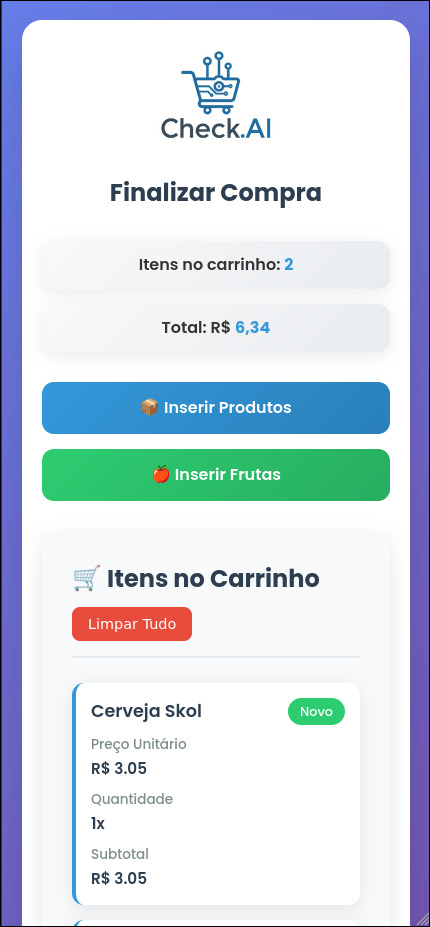
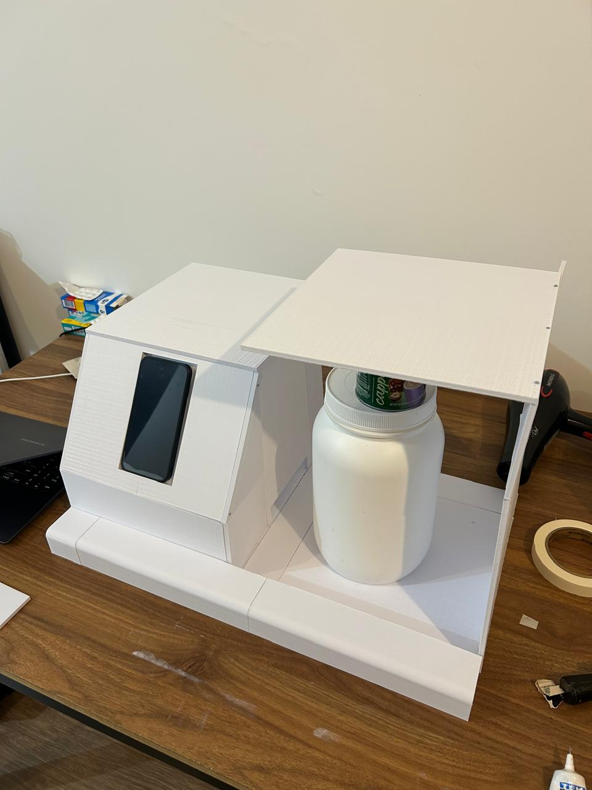
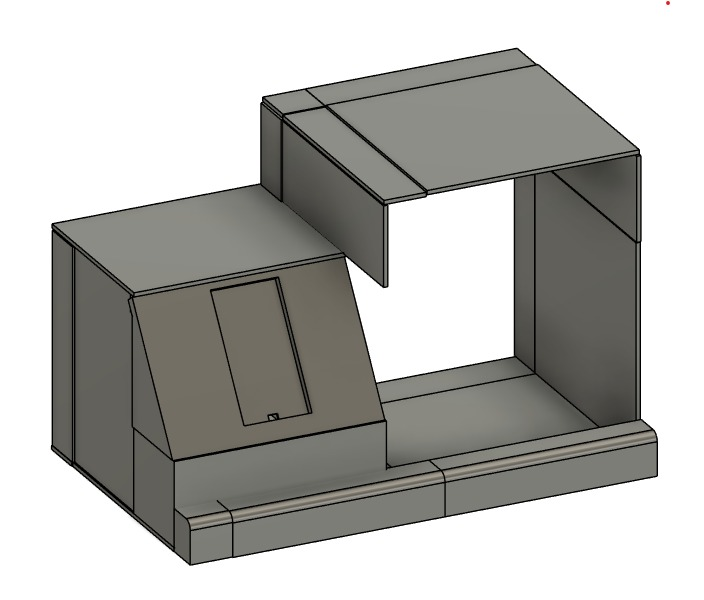

# CheckAI - AI-Powered Product Recognition System

<div align="center">
  
</div>

## Team Members
- Mateus Silva - RA: 2245310
- Sebastião Neto - RA: 2329212
- William Chakur - RA: 234293

## Project Overview

Consumers in supermarkets are constantly dealing with self-service technologies. Self-Service Technologies (SSTs) emerged with the proposal to reduce employee costs, increase service speed, and improve the consumer experience. However, studies indicate that nowadays, there is still difficulty in accepting these technologies by users, due to the difficulty in purchasing many items or items that do not have barcodes.

Therefore, the purpose of this project is to develop an easy-to-integrate technology for the recognition and classification of supermarket products, so that they can be priced simultaneously and without the use of barcodes.

## Hardware Components

### Raspberry Pi 3 Model B+
The CheckAI system is built around a **Raspberry Pi 3 Model B+**, which serves as the main processing unit for the entire system. 

The Raspberry Pi runs the Django web server and coordinates all system components including camera capture, weight measurement, and AI-powered product recognition.

### Camera Module
The system utilizes a **FULL HD USB WEBCAM** for high-quality product image capture

The camera is strategically positioned above the weighing platform to capture top-down images of products, ensuring consistent lighting and perspective for accurate AI recognition.

### Digital Balance Module
Weight measurement is handled by a **HX711 Load Cell Amplifier** connected to a precision load cell

The balance module serves dual purposes: detecting when a product is placed on the platform and providing weight data for product verification and pricing calculations.

### 3D Printed Enclosure
The entire system is housed in a **custom-designed 3D printed enclosure**

The enclosure was designed using FUSION software and printed in multiple parts for easy assembly and component access. The design prioritizes both functionality and aesthetics to create a professional-looking self-service station.

## System Screenshots

### Main Interface

*The main page of the CheckAI system showing the product recognition interface*

### User Interface

*The user interface for product scanning and identification*

### Shopping Cart

*The shopping cart view displaying recognized products and their prices*

### 3D Printing Process

*The 3D printing process of the custom enclosure components using PLA material*

### Fusion 360 CAD Design

*The CAD design of the CheckAI enclosure created in Autodesk Fusion 360 software*

## Getting Started

Use Poetry to download all project dependencies:

```bash
git clone git@github.com:MateusSilva00/oficinas02.git
cd oficinas02
poetry shell
poetry install
```

If you don't have Poetry installed, check how to install it in the [documentation](https://python-poetry.org/docs/#installation)

Initialize the Django server:
```bash
cd src
python3 manage.py runserver
```

## License

For academic use in the **Integration Workshop 2 Course**